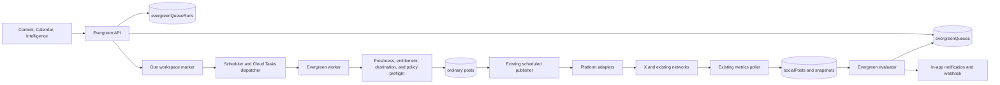

# Intelligent Evergreen Engine and Channel Expansion

> 2026-09-04 update: Performance-driven cadence changes, caption retirement, decay pauses, and the separate candidate-suggestion worker were removed. Queues retain fixed intervals and operational safeguards. The performance-evaluation sections below describe the original design; see `docs/API_CHANGELOG.md` for current behavior.

Status: Implemented core, roadmap extensions deferred  
Owners: Product and Engineering  
Last updated: 2026-09-03  
Scope: Intelligent Evergreen Queues and X. YouTube and Reddit are roadmap-only designs.

## 1. Executive summary

Markaestro's differentiator should be an **Intelligent Evergreen Engine**. It turns measured winners into user-approved, recurring distribution while explaining every decision and stopping when content becomes stale or performance declines.

The engine is not a generic recurring job. It is a product-level control loop:

```text
Measure -> identify a proven post -> user activates a queue
        -> schedule at an account-specific time -> publish normally
        -> compare mature performance -> continue, request review, or pause
```

The system will generate ordinary Markaestro posts ahead of time. Existing publishing, calendar, metrics, attribution, webhooks, and manual-delivery paths remain authoritative. Evergreen automation never bypasses publishing preflight, permissions, plan limits, or platform-specific settings.

Channel expansion follows the same capability-based model. X is included in the current implementation. YouTube and Reddit remain internal roadmap candidates because their upload, destination, policy, and compliance models require separate readiness work. Neither deferred channel may be exposed in product navigation, public API schemas, public documentation, or marketing until a future implementation is approved.

## 2. Goals

- Let a user turn a published post or Intelligence recommendation into a controlled evergreen queue.
- Explain why a post is eligible, what metric was used, the comparison baseline, sample size, and recommended time.
- Create editable future occurrences on the existing calendar.
- Rotate user-approved caption variants.
- Preserve lineage from the original post to every occurrence and its metrics.
- Pause automatically for expiration, broken destinations, policy failures, or sustained performance decay.
- Preserve manual-first delivery behavior wherever it is configured.
- Add X without weakening type safety, validation, analytics honesty, or operational controls.
- Preserve implementation-ready internal designs for YouTube and Reddit without exposing either channel publicly.
- Make platform cost, quota, permission, and review constraints first-class capabilities.
- Expose the feature through the app first, then through Public API v1 and MCP after the workflow is stable.

## 3. Non-goals

- Fully autonomous selection and publishing with no user activation.
- Automatic likes, reposts, comments, or other engagement manipulation.
- Scraping platforms or bypassing official APIs.
- Generating new media in the evergreen V1.
- Recycling arbitrary imported Reddit community content.
- Treating every platform as if it supports the same post types or metrics.
- Native platform scheduling. Markaestro remains the scheduler and publishes at the due time.
- A full social engagement inbox in this project.

## 4. Current architecture and constraints

Markaestro already provides the core building blocks:

- `socialChannelCatalog` is the source of truth for caption and media validation.
- `PLATFORM_CAPABILITY_REGISTRY` describes scopes, approval state, publishing, history, and metric availability.
- `PlatformAdapter` standardizes publish, connection checks, metrics, audience, platform post listing, and deletion.
- The OAuth layer stores encrypted access and refresh tokens in workspace-scoped connections.
- Scheduled posts use transactional claims, publish attempts, retry controls, and ordinary post states.
- The due-workspace queue dispatches bounded, idempotent workspace work through Cloud Tasks.
- Metrics are normalized with unsupported values represented as `null`, then projected into canonical `socialPosts` and immutable snapshots.
- Intelligence already computes account-specific timing, learnings, opportunities, experiments, and evidence-grounded drafts.
- The Public API, Connect API, MCP server, and signed webhooks already share the post lifecycle.

Two current constraints must be fixed before adding the three channels:

1. `settings` is one discriminated object per post. A multi-target post cannot currently carry settings for two channels. Add `settingsByChannel`, keep `settings` as a legacy fallback, and migrate reads before adding YouTube or Reddit.
2. Pending platform processing is partly TikTok-specific. YouTube uploads and X video processing require a generic asynchronous platform-operation model.

## 5. Product contract

### 5.1 Terminology

- **Queue:** a durable user-approved policy for reusing one source post.
- **Variant:** an approved caption and optional channel-specific setting override.
- **Run:** one planned occurrence produced by a queue.
- **Occurrence:** the ordinary post created for a run.
- **Evidence snapshot:** the immutable metrics and recommendation inputs shown when a queue is activated.
- **Review policy:** whether activation approves all future occurrences or each run requires review.
- **Performance maturity:** the point at which an occurrence has enough elapsed time and available metrics to evaluate.

### 5.2 User promises

- Activating a queue is explicit and reversible.
- The next occurrence is visible on the calendar before it publishes.
- Pausing a queue never removes already-published platform content.
- Deleting a queue cancels future generated occurrences but does not delete past occurrences.
- Editing an occurrence affects only that occurrence unless the user explicitly updates the queue variant.
- Markaestro never invents missing performance data.
- A queue cannot silently switch destinations or delivery modes.
- A plan downgrade pauses excess queues; it never deletes them.

### 5.3 Initial packaging

- Free and Starter: no active queues; show eligibility previews only.
- Pro: 10 active queues per brand.
- Business: unlimited active queues, subject to operational abuse limits.
- All tiers may view historical run lineage for posts they already own.

The limit belongs in `PlanLimits` as `evergreenQueuesPerBrand`. Add `evergreenOptimization` to the gated capabilities only if a separate feature flag is still needed for rollout.

## 6. High-level architecture



### 6.1 Architectural principle

The evergreen worker creates posts. It does not publish them directly. This keeps one path for validation, retries, manual handoffs, metrics, and user-visible state.

## 7. Data model

All collections remain under `workspaces/{workspaceId}` and are unreachable from the browser except through authenticated API routes.

### 7.1 `evergreenQueues/{queueId}`

```ts
type EvergreenQueue = {
  workspaceId: string;
  productId: string;
  sourcePostId: string;
  status: 'draft' | 'active' | 'paused' | 'needs_review' | 'completed' | 'archived';
  version: number;

  sourceSnapshot: {
    content: string;
    mediaUrls: string[];
    mediaFingerprint: string;
    capturedAt: string;
    sourcePublishedAt: string;
  };

  targets: Array<{
    channel: SocialChannel;
    destinationId?: string;
    destinationProvider?: string;
    deliveryMode: PublicDeliveryMode;
    settings?: PostSettings;
    reviewPolicy: 'activation_approves_runs' | 'review_each_run';
  }>;

  schedulePolicy: {
    mode: 'fixed_interval' | 'learned_window';
    intervalDays: number;
    minimumGapDays: number;
    timezone: string;
    preferredLocalTime?: string;
    earliestNextRunAt: string;
    generationLeadHours: number;
  };

  stopPolicy: {
    endsAt?: string;
    maximumRuns?: number;
    pauseOnBrokenLink: boolean;
    pauseOnPerformanceDecay: boolean;
  };

  evidence: {
    objective: string;
    metric: string;
    sourceValue: number;
    accountBaseline: number;
    sampleSize: number;
    recommendationId?: string;
    timingSampleSize?: number;
    capturedAt: string;
  } | null;

  nextRunAt: string | null;
  runCount: number;
  consecutiveUnderperformingRuns: number;
  lastRunAt?: string;
  lastEvaluationAt?: string;
  pauseReason?: string;

  leaseId?: string;
  leaseUntil?: FirebaseFirestore.Timestamp;
  createdBy: string;
  activatedBy?: string;
  createdAt: string;
  updatedAt: string;
  archivedAt?: string;
};
```

The source snapshot is immutable. It prevents later edits to the original record from silently changing an approved queue. Updating the queue creates a new `version` and a new snapshot.

### 7.2 `evergreenQueueVariants/{variantId}`

```ts
type EvergreenVariant = {
  workspaceId: string;
  queueId: string;
  queueVersion: number;
  ordinal: number;
  caption: string;
  settingsByChannel?: Partial<Record<SocialChannel, PostSettings>>;
  status: 'active' | 'retired';
  createdBy: string;
  createdAt: string;
  updatedAt: string;
};
```

Variants live in a workspace-level collection rather than an embedded array. This keeps queue documents bounded when captions are long and provides an audit trail across queue versions.

### 7.3 `evergreenQueueRuns/{runId}`

Use the deterministic id `${queueId}_${queueVersion}_${runNumber}`.

```ts
type EvergreenQueueRun = {
  workspaceId: string;
  productId: string;
  queueId: string;
  queueVersion: number;
  runNumber: number;
  variantId: string;
  postId?: string;
  plannedFor: string;
  generationState: 'claimed' | 'scheduled' | 'needs_review' | 'skipped' | 'cancelled';
  skipReason?: string;
  evaluationStatus: 'not_due' | 'due' | 'complete' | 'unavailable';
  evaluationDueAt?: string;
  performance?: {
    metric: string;
    value: number;
    comparableBaseline: number;
    normalizedIndex: number;
    matureAt: string;
  };
  createdAt: string;
  updatedAt: string;
};
```

The occurrence's actual delivery status remains on `posts/{postId}`. The run stores generation and evaluation state only.

### 7.4 Ordinary post additions

```ts
type EvergreenLineage = {
  queueId: string;
  queueVersion: number;
  runId: string;
  runNumber: number;
  sourcePostId: string;
  variantId: string;
};

type PostAdditions = {
  evergreen?: EvergreenLineage;
  settingsByChannel?: Partial<Record<SocialChannel, PostSettings>>;
};
```

`settings` remains readable for legacy records. New writes populate `settingsByChannel`; single-channel compatibility responses may continue returning `settings`.

### 7.5 Generic platform operations

```ts
type PlatformOperation = {
  workspaceId: string;
  postId: string;
  channel: SocialChannel;
  destinationId?: string;
  kind: 'media_upload' | 'publish' | 'processing' | 'thumbnail';
  state: 'queued' | 'running' | 'waiting' | 'succeeded' | 'failed' | 'expired';
  externalOperationId?: string;
  externalResourceId?: string;
  nextPollAt?: string;
  attemptCount: number;
  expiresAt?: string;
  lastErrorCode?: string;
  createdAt: string;
  updatedAt: string;
};
```

Store these under `posts/{postId}/platformOperations/{operationId}`. Keep top-level post fields as the denormalized current outcome for existing consumers.

### 7.6 Required indexes

- `evergreenQueues`: `status ASC, nextRunAt ASC`.
- `evergreenQueueRuns`: `evaluationStatus ASC, evaluationDueAt ASC`.
- `evergreenQueueRuns`: `queueId ASC, plannedFor DESC`.
- `posts`: `evergreen.queueId ASC, scheduledAt DESC` if the Firestore index validator supports nested fields.
- Existing scheduled-post and metrics indexes remain unchanged.

Add all new collections to `docs/operations/data-access.md` and keep Firestore rules deny-by-default.

## 8. API design

### 8.1 App API

| Method | Route | Purpose |
| --- | --- | --- |
| GET | `/api/evergreen-queues` | List by brand and status |
| POST | `/api/evergreen-queues/preview` | Compute eligibility, evidence, and suggested schedule without writing |
| POST | `/api/evergreen-queues` | Create a draft queue and its variants |
| GET | `/api/evergreen-queues/{id}` | Read queue, variants, and recent runs |
| PUT | `/api/evergreen-queues/{id}` | Replace editable policy using optimistic version checking |
| POST | `/api/evergreen-queues/{id}/activate` | Validate and activate |
| POST | `/api/evergreen-queues/{id}/pause` | Pause and optionally cancel future occurrences |
| POST | `/api/evergreen-queues/{id}/resume` | Revalidate and compute a new next run |
| DELETE | `/api/evergreen-queues/{id}` | Archive and cancel unpublished future occurrences |
| GET | `/api/evergreen-queues/{id}/runs` | Cursor-paginated run history |

### 8.2 Permissions

- Add `evergreen.read` and `evergreen.manage` to RBAC.
- Analyst: `evergreen.read` only.
- Member: read and manage drafts; activation also requires `posts.publish`.
- Admin and owner: full queue management.
- Queue activation requires verified email and an active entitled plan.

Every mutation validates workspace, product ownership, source-post ownership, destination ownership, and media ownership. Do not trust ids from the queue body.

### 8.3 Public API and MCP

Add after app rollout proves the model:

- Scopes: `evergreen.read`, `evergreen.write`.
- Equivalent `/api/public/v1/evergreen-queues` routes.
- MCP tools: `preview_evergreen_queue`, `create_evergreen_queue`, `pause_evergreen_queue`, `list_evergreen_runs`.
- Creating a draft queue does not require publish confirmation. Activating one is a durable future-publishing authorization and must require explicit confirmation in the MCP tool description.

### 8.4 Webhook events

- `evergreen.queue.activated`
- `evergreen.queue.paused`
- `evergreen.queue.needs_review`
- `evergreen.run.scheduled`
- `evergreen.run.skipped`
- `evergreen.run.underperformed`
- `evergreen.queue.completed`

Do not include captions, tokens, or platform response bodies in webhook payloads.

## 9. Eligibility and evidence

### 9.1 Hard eligibility

A source post is eligible only when:

- It belongs to the selected workspace and brand.
- It reached `published` on at least one requested target.
- It is at least 72 hours old, unless the user creates a draft queue without activating it.
- The selected targets still have compatible connections and settings.
- Its media still exists and passes current platform validation.
- It is not part of a still-running experiment.
- It is not marked time-sensitive or expired.
- It is not already the source of an active queue for the same destination.
- The selected delivery mode remains supported.

### 9.2 Recommendation eligibility

The Intelligence recommendation appears only when:

- The objective metric is available for the source target.
- At least 10 comparable brand posts exist for that channel and content type.
- The source exceeds the comparable median by at least 25 percent.
- The result uses a mature metrics snapshot.
- The post does not contain a known-expired tracked link or declared promotion end date.

These are product thresholds, not claims of statistical significance. Store them in versioned configuration so historical explanations remain reproducible.

### 9.3 Evidence snapshot

Activation copies the recommendation inputs into the queue. Later changes to the Intelligence cache cannot rewrite why the user approved the queue.

## 10. Scheduling algorithm

### 10.1 Fixed interval

1. Start at `max(earliestNextRunAt, lastPublishedAt + minimumGapDays)`.
2. Convert to the brand timezone.
3. Apply the preferred local time.
4. Resolve conflicts using the existing scheduled-post query.
5. Move forward to the first free slot within seven days.

### 10.2 Learned window

1. Read cached account-specific timing recommendations.
2. Require the minimum sample size already enforced by Intelligence.
3. Pick the highest-ranked future slot after the minimum gap.
4. Down-rank occupied slots using existing conflict detection.
5. If recommendations are unavailable, fall back to the queue's preferred local time and label the run `fixed fallback`.

### 10.3 Generation lead time

Generate one occurrence ahead by default, 48 hours before its planned publish time. This makes it visible and editable without filling the calendar with months of derived posts. A future Business option may generate four weeks ahead.

### 10.4 Variant selection

Choose variants round-robin by `runNumber`, skipping retired variants. Selection is deterministic and recorded before post creation so retries cannot choose a different caption.

## 11. Worker algorithm and concurrency

### 11.1 Due-workspace integration

Add `evergreen_queue` and `evergreen_evaluation` to `WorkspaceWorkReason`. `scheduleNextWorkspaceWork` queries the earliest active `nextRunAt` and earliest due evaluation alongside existing work.

### 11.2 Queue generation

For each due queue, bounded to 20 per workspace tick:

1. Transactionally acquire a five-minute queue lease.
2. Allocate the next run number and create the deterministic run record as `claimed`.
3. Recheck entitlement, queue version, stop policy, source/media availability, destination health, and platform policy.
4. Resolve the schedule and variant outside the transaction.
5. Create an ordinary post with a deterministic id derived from the run id.
6. Set the run to `scheduled` or `needs_review` and store `postId`.
7. Advance `nextRunAt` from the planned time, not worker wall-clock time.
8. Release the lease and mark the workspace due for the new scheduled post and future queue time.

A retry sees the deterministic run and post ids and returns the existing result. No duplicate post is created.

### 11.3 Review-each-run behavior

When any target has `review_each_run`, create the occurrence as `draft`, set the run to `needs_review`, and notify the queue owner. Do not advance another occurrence until the draft is scheduled, skipped, or the review deadline passes.

Initial defaults:

- Existing core platforms and X: activation may approve future runs.
- YouTube: review each run in V1 because titles, thumbnails, privacy, and reused video are high-impact choices.
- Reddit: review each run in V1 because subreddit rules, flair, and repeated promotional content are community-specific.

These are Markaestro safety defaults, not representations of platform requirements.

### 11.4 Cancellation

Pausing with `cancelFuture=true` changes unpublished derived posts back to draft or cancels them using the existing mutable-post rules. Never alter a post already in `publishing`, `published`, or `platform_action_required`.

## 12. Freshness and safety controls

- Add an optional `contentExpiresAt` field to posts and queue policies.
- Validate Markaestro tracked-link status before every generated run.
- For arbitrary links, use the existing safe outbound URL guard, block private addresses, disable redirects or validate each redirect hop, and apply a tight timeout.
- Flag time-sensitive phrases as a warning only. Deterministic declarations and expiration dates enforce blocking.
- Re-run current channel validation at generation and again at publish time.
- Pause on removed destination, revoked token, unsupported setting, deleted media, or repeated permanent publish failure.
- Do not auto-retry a permanent policy rejection by creating a new occurrence.
- Maintain per-brand and per-destination generation caps to prevent accidental queue storms.

## 13. Performance evaluation and decay

### 13.1 Comparable-age evaluation

Evaluate a run at the same metric age used for its source evidence, initially seven days. Do not compare a 24-hour occurrence with a 30-day source total.

### 13.2 Normalized performance index

```text
normalizedIndex = occurrence objective metric / median objective metric
```

The denominator uses comparable posts from the same brand, channel, content type, and metric age. When the metric is a rate, use the existing rate calculation and null handling.

### 13.3 Auto-pause rule

Auto-pause only when all conditions hold:

- At least 10 comparable posts exist.
- Two consecutive mature runs each have a normalized index below 0.60.
- Both runs also perform below 60 percent of the source post at the same metric age.
- No known platform analytics outage or missing-scope condition applies.

Label this as a conservative decay rule, not statistical significance. The user can resume after changing variants or policy.

### 13.4 Attribution

Each occurrence gets its own tracked-link attribution while retaining queue lineage. Analytics shows:

- source post performance;
- per-run performance;
- queue lifetime totals;
- incremental clicks and conversions;
- active, paused, and decayed queues.

## 14. UI design

### 14.1 Entry points

- Published post card: `Recycle` action.
- Intelligence opportunity: `Create evergreen queue` action when eligible.
- Content page: new `Evergreen` tab.
- Calendar: evergreen badge, queue name, source link, and run number.

### 14.2 Creation flow

1. Evidence: show source performance, baseline, sample size, and why it is eligible.
2. Destinations: preselect only destinations where the source successfully published.
3. Variants: source caption plus up to two user-approved alternatives.
4. Timing: learned window or fixed interval, minimum gap, timezone, and first date.
5. Safety: expiration, maximum runs, link checks, and performance auto-pause.
6. Review: summarize durable authorization and activate.

### 14.3 Queue detail

- Status and next action.
- Immutable activation evidence.
- Upcoming occurrence with edit link.
- Run history and normalized performance.
- Pause reason and remediation.
- Audit trail for create, activate, edit, pause, resume, and archive.

### 14.4 Empty and unavailable states

- Not enough data: state the sample count required and current count.
- Metric unavailable: explain scope or account eligibility from the capability registry.
- Plan unavailable: show the Pro limit without hiding existing historical runs.
- Destination unavailable: link to reconnection.

All new user-visible copy must pass `npm run copy:check` and be added to every supported locale before release.

## 15. Channel expansion framework

### 15.1 Shared prerequisites

Before adding any channel:

1. Add `settingsByChannel` and migrate publisher reads with legacy fallback.
2. Add generic `platformOperations` for asynchronous upload and processing.
3. Extend `PlatformCapabilityContract` with:
   - `costModel` and an operator-configured budget key;
   - `asyncPublishing` behavior;
   - `evergreenPolicy`: allowed, minimum product gap, and default review policy;
   - `retentionPolicy` and reconciliation interval;
   - destination-discovery capabilities.
4. Add adapter contract tests that run against fixtures for publish, metrics, auth failure, rate limiting, permanent validation, and deletion.
5. Add per-provider feature flags and rollout stages independent of the Intelligence rollout.
6. Add provider-specific rate-limit buckets, usage counters, circuit breakers, and cost alerts.
7. Update OpenAPI, Public API docs, MCP channel rules, previews, onboarding, marketing copy, billing labels, and every locale.

### 15.2 Channel readiness states

Track channel support separately for:

- connect;
- publish text/image/video/carousel;
- platform settings;
- metrics;
- audience;
- native history import;
- delete;
- evergreen activation.

A channel may launch publishing before analytics or evergreen support. The UI and API must say which capability is unavailable.

## 16. X design

### 16.1 Scope and complexity

Complexity: **medium-high**, estimated 4 to 6 engineer-weeks after shared prerequisites. External billing and policy review can extend calendar time.

V1 supports text, one to four images, one GIF, or one video; direct publishing; deletion; post metrics; audience count; and optional thread creation in a later increment.

### 16.2 OAuth and connection

- Provider key: `x`.
- Use OAuth 2.0 Authorization Code with PKCE.
- Initial scopes: `tweet.read`, `tweet.write`, `users.read`, `media.write`, `offline.access`.
- Store X user id as `accountKey`, username as `accountLabel`, and granted scopes in metadata.
- Refresh tokens require `offline.access`; integrate with the existing refresh queue.

### 16.3 Publishing

- Text: `POST /2/tweets`.
- Images may use the simple v2 media upload.
- Video and larger media use initialize, append, finalize, and status polling before creating the post.
- Use string ids throughout because X identifiers exceed safe JavaScript integer precision.
- Store the post id as `externalId` and construct the permalink from the resolved username and id.
- Map 429 responses to the platform rate-limit reset time, not generic exponential retries.

### 16.4 Validation and settings

Add `xSettingsSchema` with reply controls and optional sensitivity metadata only after verifying product access. Start with a conservative standard text limit and reject unsupported long-form posts rather than guessing account entitlements.

The media validator must enforce the mutually exclusive image-set versus GIF/video shapes. Video processing can remain `publishing` while its platform operation waits.

### 16.5 Metrics

- Public metrics include impressions, likes, reposts, replies, quotes, and bookmarks.
- User-context metrics can include link clicks, profile clicks, engagements, and video playback milestones.
- Non-public, organic, and promoted metrics have a 30-day availability window. Poll rich metrics aggressively within 30 days, then retain only the normalized historical snapshots allowed by X terms and Markaestro's legal review.
- Normalize reposts to `shares`, replies to `comments`, URL clicks to `clicks`, profile clicks to `profileVisits`, and video view/playback values to the existing video fields.

### 16.6 Cost and quota intricacies

X currently uses prepaid pay-per-use credits. Reads and writes have different prices, and content creation containing a URL is materially more expensive than a basic content write. Evergreen queues can magnify both write and analytics-read costs.

Required controls:

- Record estimated and actual X API cost by workspace, brand, operation, and queue.
- Add a global monthly X budget, a per-workspace soft budget, and a hard circuit breaker.
- Display a cost warning when an evergreen queue contains a link.
- Deduplicate metric reads within X's daily billing window.
- Stop retrying when credits are exhausted and surface `CHANNEL_BILLING_ACTION_REQUIRED`.

### 16.7 Evergreen policy

- Allowed after metrics are working.
- Default minimum gap: 30 days as a Markaestro product default.
- Activation may approve future runs.
- Threads are not recycled in V1.
- A source with a URL must pass the X cost forecast and tracked-link freshness checks.

## 17. YouTube design

### 17.1 Scope and complexity

Complexity: **very high**, estimated 6 to 9 engineer-weeks after shared prerequisites, plus an external audit whose duration Markaestro does not control.

V1 supports one video per post, title, description, tags, category, privacy, made-for-kids declaration, optional custom thumbnail, upload status, deletion, video analytics, and channel subscriber count. Shorts-compatible media uses the normal upload API; Markaestro should describe it as a vertical short-form upload rather than promise classification as a Short.

### 17.2 OAuth and connection

- Provider key: `youtube`.
- Google OAuth with offline access and incremental authorization.
- Scopes: `youtube.upload` for publishing plus `yt-analytics.readonly` for owned analytics. Add broader YouTube scopes only when a concrete feature requires them.
- Store channel id as `accountKey` and channel title as `accountLabel`.
- Handle Google accounts that manage multiple Brand Accounts by discovering the authorized channel identity and making the selected channel explicit.

### 17.3 Publishing pipeline

1. Validate one video and required metadata.
2. Initiate a resumable `videos.insert` upload.
3. Stream media from Markaestro storage without buffering the entire file in memory.
4. Persist the resumable session URI in a platform operation, encrypted if it contains authorization material.
5. Resume from the last accepted byte after transient failure.
6. Store the video id as soon as YouTube returns it.
7. Poll processing status until succeeded or failed.
8. Upload an optional custom thumbnail after a video id exists.
9. Mark the post published only when processing and required metadata operations succeed. Report partial failure if the video succeeds but the optional thumbnail fails.

Cloud Tasks requests currently have a five-minute deadline. Large uploads should use a dedicated upload task with resumable checkpoints instead of holding the workspace tick open.

### 17.4 Settings

Add `youtubeSettingsSchema`:

```ts
{
  __type: 'youtube';
  title: string;
  description?: string;
  tags?: string[];
  categoryId: string;
  privacyStatus: 'private' | 'unlisted' | 'public';
  madeForKids: boolean;
  notifySubscribers?: boolean;
  playlistId?: string;
  thumbnailMediaAssetId?: string;
}
```

Do not infer `madeForKids`. Require the user's declaration. Do not change privacy on an existing video without express confirmation.

### 17.5 Metrics

- Use YouTube Analytics API targeted queries for owned video metrics.
- Normalize views, engaged views, likes, comments, shares, estimated watch time, average view duration, subscribers gained, and subscribers lost.
- Preserve source field names in `raw` and label delayed or threshold-suppressed data honestly.
- The channel owner must authorize analytics access.

### 17.6 Quota and compliance intricacies

- YouTube now uses a granular upload quota bucket. Current default documentation describes 100 `videos.insert` calls per day, with other API operations using separate quota.
- Unverified API projects created after July 28, 2020 can upload only private videos. A compliance audit is required before public production publishing.
- Requests for more quota require a compliance audit.
- YouTube requires many stored metadata fields to be deleted or refreshed within 30 days. Authorized analytics can be retained longer only while authorization remains valid and the video still exists.
- Custom thumbnails have their own quota cost and permission failures.
- Branding and attribution requirements apply anywhere YouTube content is displayed.

Required controls:

- Daily upload quota reservation before scheduling.
- A quota forecast in queue activation and bulk scheduling.
- Thirty-day authorization and resource reconciliation.
- A provider-wide kill switch for policy or audit issues.
- A production readiness gate that prevents public privacy status until audit approval is recorded.

### 17.7 Evergreen policy

- Review each run in V1.
- Do not automatically re-upload the identical video by default. Require a newly selected media asset or an explicit `reuse exact video` confirmation for each run.
- Use evergreen lineage mainly for recurring series and refreshed variants, not duplicate-video spam.
- Auto-pause when quota reservation fails or the source metadata becomes stale.

## 18. Reddit design

### 18.1 Scope and complexity

Complexity: **high**, estimated 4 to 6 engineer-weeks for text and link posts after shared prerequisites. Native image/video support adds roughly 2 to 4 weeks and should be a separate release.

Reddit is not just another profile feed. The destination is a subreddit with its own rules, post requirements, flair, allowed content types, moderation, and community norms.

### 18.2 Access and OAuth

- Provider key: `reddit`.
- Production access requires Reddit authorization under its current Data API policies.
- Use OAuth and a unique, truthful User-Agent in Reddit's required format.
- Initial scopes: identity, submit, read, and history. Request edit or delete-related scopes only if the matching feature ships.
- Store the Reddit account id/name on the connection. Store the subreddit as the post destination, not the credential identity.

### 18.3 Destination discovery

- Search or validate a subreddit at compose time.
- Fetch subreddit rules, allowed post types, post requirements, and available flair.
- Cache destination metadata briefly, but revalidate requirements before publish.
- A multi-target post may target only one subreddit in V1. Cross-posting the same payload to several communities creates spam risk and conflicts with the current one-destination-per-channel model.

### 18.4 Publishing

V1 uses `POST /api/submit` for:

- self posts with title and Markdown body;
- link posts with title and URL.

Add `redditSettingsSchema`:

```ts
{
  __type: 'reddit';
  subreddit: string;
  kind: 'self' | 'link';
  title: string;
  flairId?: string;
  flairText?: string;
  nsfw: boolean;
  spoiler: boolean;
  sendReplies?: boolean;
}
```

Return Reddit's structured validation errors to the composer. A 200 transport response is not necessarily a successful submission; parse the JSON error array and require the returned post identity.

### 18.5 Metrics and moderation state

V1 metrics are limited compared with major business-account APIs:

- score or upvotes where returned;
- upvote ratio;
- comment count;
- awards only if permitted and useful;
- removal/deletion state.

Do not present score as reach, impressions, or unique audience. A moderator removal is a distinct permanent outcome and pauses an evergreen queue for that subreddit.

### 18.6 Rate limit and data-governance intricacies

- Current free access is documented at 100 queries per minute per OAuth client id, averaged over a ten-minute window.
- Track `X-Ratelimit-Used`, `X-Ratelimit-Remaining`, and `X-Ratelimit-Reset` on every response.
- Reddit requires removal of deleted user content and strongly recommends routine deletion of stored user data and content within 48 hours.
- Do not import arbitrary community posts or comments into Markaestro Intelligence.
- Do not send Reddit-derived third-party content to an AI model without a separately approved legal and platform basis.
- Disable native history import in V1. For Markaestro-authored posts, store the user's original content as first-party data and keep platform-derived identifiers and metrics subject to Reddit reconciliation.

### 18.7 Evergreen policy

- Review each run in V1.
- One active queue per source and subreddit.
- Default minimum gap: 90 days as a conservative Markaestro product default.
- Re-fetch rules, requirements, and flair before every run.
- Any moderator removal, subreddit ban, repeated validation rejection, or negative queue health signal pauses the queue.
- Never automatically post the same promotion to multiple subreddits.

## 19. Platform complexity comparison

| Area | X | YouTube | Reddit |
| --- | --- | --- | --- |
| OAuth | PKCE, refresh scope | Google OAuth, offline access, Brand Account identity | OAuth plus external access approval |
| Destination | User account | Channel or Brand Account | Account credential plus subreddit target |
| Media pipeline | Simple image, async chunked video/GIF | Large resumable video, processing, thumbnail | Text/link first; native media is separate complexity |
| Publish completion | Usually immediate after media processing | Upload accepted before processing completes | Structured errors and moderator state can follow submission |
| Analytics | Rich, but paid reads and 30-day private-metric window | Rich owned analytics, delayed/thresholded data | Limited public engagement, no honest reach metric |
| Cost/quota | Direct pay-per-use cost per read/write | Granular daily quota and audit | Shared client rate limit and access policy |
| Compliance gate | Developer terms and prepaid credits | Verification/audit before public uploads | Reddit authorization, retention, community rules |
| Evergreen default | Activation can approve | Review every run | Review every run |
| Estimated engineering | 4 to 6 weeks | 6 to 9 weeks | 4 to 6 weeks text/link; +2 to 4 media |

## 20. Security and privacy

- Continue encrypting OAuth and refresh tokens with the existing secret-management boundary.
- Never store resumable-session credentials in logs or webhook payloads.
- Validate all media and link ownership server-side.
- Reuse outbound URL and SSRF defenses for link freshness checks.
- Use provider error codes, not user-visible message matching, to classify retryable, auth, quota, policy, and permanent errors.
- Store platform raw responses only in the existing private raw-metrics boundary with retention rules.
- Add deletion and revocation reconciliation for provider-specific requirements.
- Audit every queue mutation with actor, previous state, next state, and reason.
- Apply per-user, workspace, destination, and provider rate limits to queue creation and activation.

## 21. Observability and operations

### 21.1 Structured events

- `evergreen.queue_created`
- `evergreen.queue_activated`
- `evergreen.run_generated`
- `evergreen.run_generation_failed`
- `evergreen.queue_paused`
- `evergreen.evaluation_completed`
- `evergreen.decay_detected`
- `platform.operation_waiting`
- `platform.operation_failed`
- `platform.quota_low`
- `platform.cost_budget_reached`

### 21.2 SLOs

- 99.9 percent of due evergreen runs generated within five minutes of generation lead time.
- Fewer than 0.1 percent duplicate run or occurrence creation.
- 99 percent of queue mutations visible in the calendar within two seconds.
- Platform publish SLOs remain channel-specific and exclude user-action-required states.
- No provider exceeds its configured hard cost or quota budget.

### 21.3 Dashboards and alerts

- Due queue depth and oldest due age.
- Runs generated, skipped, awaiting review, and auto-paused.
- Publish success by evergreen versus one-off.
- X spend and balance warnings.
- YouTube upload quota reservations and processing age.
- Reddit remaining rate limit and moderation removals.
- Queue-level incremental clicks, conversions, and normalized performance.

## 22. Testing strategy

### 22.1 Unit tests

- Queue schemas and state transitions.
- Eligibility and evidence snapshots.
- Fixed and learned scheduling across DST boundaries.
- Variant rotation and retired variants.
- Stop policies and decay calculation.
- Settings-by-channel legacy fallback.
- Provider response/error normalization.
- Media and destination validation for all three channels.

### 22.2 Integration tests

- Concurrent workers claim one queue once.
- Retried generation produces one run and one post.
- Pause cannot mutate already-published occurrences.
- Downgrade pauses excess queues deterministically.
- Metrics attach to the correct run and source lineage.
- OAuth callback, refresh, revoke, reconnect, and destination selection.
- X chunked upload resume.
- YouTube resumable upload checkpoint and processing poll.
- Reddit structured error parsing and rule refresh.

### 22.3 Contract tests

Use recorded, redacted provider fixtures for success, 401, 403, 404, 409, 429, 5xx, malformed responses, missing metrics, and permanent policy rejection. Live smoke tests must use dedicated test accounts and private/unlisted destinations.

### 22.4 End-to-end tests

- Published post to active queue to visible occurrence.
- Edit occurrence without changing queue source.
- Pause and cancel future occurrence.
- Two underperforming mature runs trigger a reviewable pause.
- Each new platform can connect, schedule, publish, surface status, and collect honest metrics.

Run `npm run ci`, production build, Firestore emulator tests, query validation, OpenAPI checks, i18n checks, and provider smoke tests before rollout.

## 23. Rollout and migration

### 23.1 Data migration

- No backfill is required for evergreen queues.
- Add `settingsByChannel` as optional.
- Dual-read `settingsByChannel[channel] ?? settings`.
- New app and Public API writes populate the map.
- After one release, optionally backfill single-channel posts for consistency. Do not remove `settings` until all SDKs and stored posts age out.

### 23.2 Feature rollout

Use stages `off`, `shadow`, `allowlist`, `percentage`, and `entitled_ga`, with a global kill switch and per-provider kill switches.

- Shadow: compute eligibility and due runs without writing posts.
- Allowlist: internal brands and test accounts.
- Percentage: Pro/Business workspaces, no Public API activation.
- Entitled GA: app workflow.
- API/MCP GA: after at least 30 days of stable app behavior.

### 23.3 Provider rollout

Each provider advances connect, publish, metrics, and evergreen stages independently. Public marketing must not call a channel supported until direct publishing is approved and stable.

## 24. Open decisions before implementation

1. Confirm Pro's limit of 10 active queues per brand and Business unlimited.
2. Confirm whether activation approves all future core-platform runs or whether Pro defaults to review-each-run.
3. Choose X cost ownership: included allowance, workspace pass-through, or plan-based fair-use pool.
4. Decide whether YouTube V1 accepts only Shorts-oriented media or all video uploads.
5. Obtain legal/platform approval for Reddit commercial API use before engineering beyond a sandbox spike.
6. Confirm whether exact YouTube video reuse is ever allowed by product policy.
7. Decide whether Public API queue activation ships with V1 or after app-only stabilization. This design recommends later.

## 25. Source and policy references

Checked 2026-09-03. Platform rules and prices can change; the quarterly capability audit must verify them before implementation and release.

### X

- [Manage posts](https://docs.x.com/x-api/posts/manage-tweets/introduction)
- [OAuth 2.0 Authorization Code with PKCE](https://docs.x.com/fundamentals/authentication/oauth-2-0/authorization-code)
- [Chunked media upload](https://docs.x.com/x-api/media/quickstart/media-upload-chunked)
- [Media best practices](https://docs.x.com/x-api/media/quickstart/best-practices)
- [Post metrics](https://docs.x.com/x-api/fundamentals/metrics)
- [Rate limits](https://docs.x.com/x-api/fundamentals/rate-limits)
- [Pay-per-use pricing](https://docs.x.com/x-api/getting-started/pricing)

### YouTube

- [Upload a video](https://developers.google.com/youtube/v3/guides/uploading_a_video)
- [Videos insert reference](https://developers.google.com/youtube/v3/docs/videos/insert)
- [YouTube Data API quota](https://developers.google.com/youtube/v3/getting-started#quota)
- [Quota and compliance audits](https://developers.google.com/youtube/v3/guides/quota_and_compliance_audits)
- [YouTube Analytics metrics](https://developers.google.com/youtube/analytics/metrics)
- [Channel reports and authorization](https://developers.google.com/youtube/analytics/channel_reports)
- [Developer policies and retention](https://developers.google.com/youtube/terms/developer-policies)

### Reddit

- [Reddit Data API Wiki](https://support.reddithelp.com/hc/en-us/articles/16160319875092-Reddit-Data-API-Wiki)
- [Reddit API reference](https://www.reddit.com/dev/api/)
- [Submit endpoint](https://www.reddit.com/dev/api/#POST_api_submit)
- [Developer Terms](https://redditinc.com/policies/developer-terms)
- [Data API Terms](https://redditinc.com/policies/data-api-terms)
